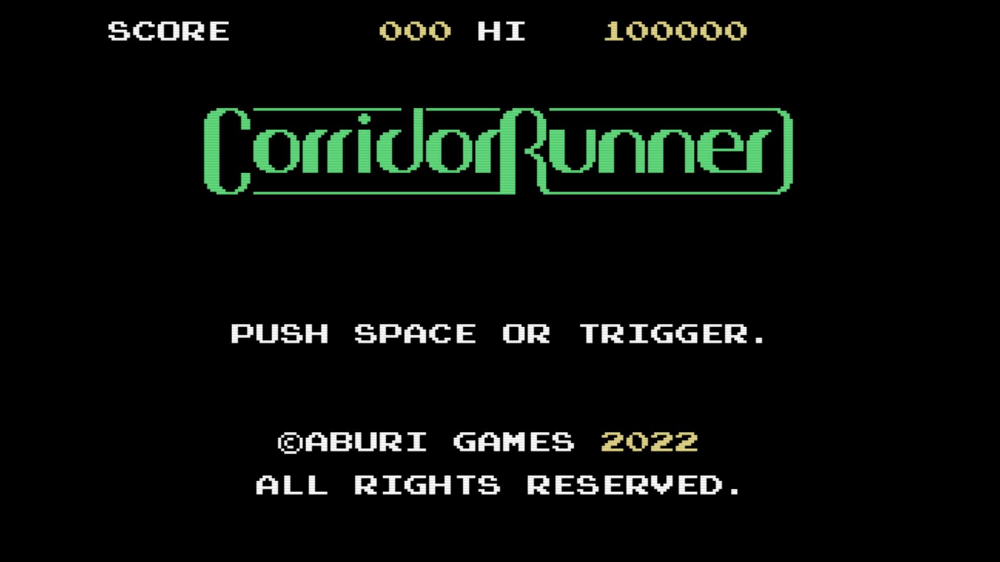
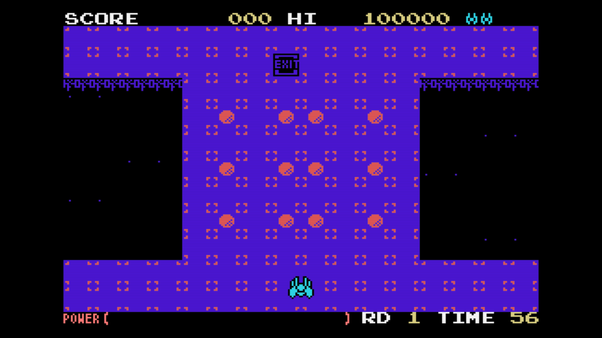

[ [Engligh](README.md) | [日本語](README.ja.md) ]

---
# Corridor Runner for MSX



## How to play

[Play on WebMSX](https://webmsx.org/?MACHINE=MSX1J&ROM=https://github.com/aburi6800/msx-CorridorRunner/raw/v1.1.0/dist/c-runner.rom&FAST_BOOT)

### Control

- Cursor key :
    - Left & Right : Change player direction
    - Down : Press to charge power, release to move forward.
    - Can change direction while moving forward.
- [F1] :
    - Pause
- [F5] :
    - Continue (Press when the game is over)

### Rules (tentative)



- Score points when you take an item chip.
- Score is increased if you take them consecutively.
- Misses if it falls off the floor or touches an enemy.
- When you get to the exit, the round is clear.
- The first 20,000 pts, and every 50,000 pts thereafter, will increase the number of remaining units.
- The game is cleared when all 16 rounds are completed.

## Build

z88dk and cmake are required. Install in advance.  
Clone the project, enter the project root folder, and do the following.  

```
$ mkdir build && cd build
$ cmake -DCMAKE_TOOLCHAIN_FILE=../cmake/z88dk.cmake ..
$ make clean && make
```
The `c-runner.rom` file is output to the project's `dist` directory.  
  
  
## Run with openMSX

OpenMSX is available from:  

[openMSX](https://openmsx.org/)

On the command line, from the project root directory do the following:

```
$ openmsx ./dist/c-runner.rom
```
Or load `c-runner.rom` from the activated OpenMSX.

## License

MIT License

## Thanks

- [Z88DK - The Development Kit for Z80 Computers](https://github.com/z88dk/z88dk)
- [C-BIOS](http://cbios.sourceforge.net/)
- [openMSX](https://openmsx.org/)
- [LovelyComposer](https://github.com/doc1oo/LovelyComposerDocs)
